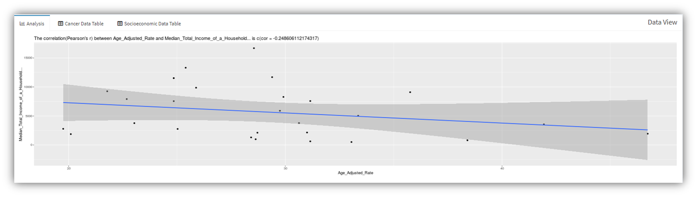
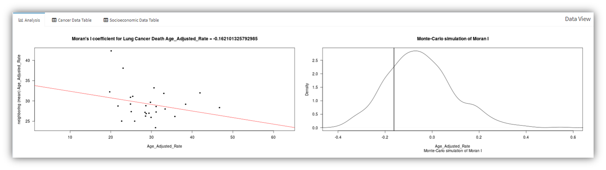

## HealthWebMapper2.0

[HealthWebMapper 2.0](https://haihonghuang.shinyapps.io/HealthWebMapper2/) is a web mapping application designed for visualizing cancer disparities in San Diego Sub-Regional Areas(SRAs). 

It was developed and hosted by: [R Shiny](https://shiny.rstudio.com/) and [shinyapps.io](https://www.shinyapps.io/)

HealthWebMapper2.0 URL: https://haihonghuang.shinyapps.io/HealthWebMapper2/

Demo datasets URL: https://humandynamics.sdsu.edu/demo-data.html

Data source: [Live Well San Diego Data Access Portal](https://data.livewellsd.org/)

## How to use (Demo)

1. Open [HealthWebMapper2.0](https://haihonghuang.shinyapps.io/HealthWebMapper2/), in upper right corner, click icon [Demo Data](http://humandynamics.sdsu.edu/demo-data.html) and download preprocessed datasets, for example, download Lung_Cancer_Death_2015_SRA.csv and census2013.csv

2. input data    
    
   Step 1: upload Lung_Cancer_Death_2015_SRA.csv as cancer data   
   
   Step 2: upload census2013.csv as socioeconomic data
   
        
   
   *After uploading two csv files, ignore the error in map panel. If upload correctly, the error message will fade and two side-by-side maps will automatically show up within a few seconds
   
   *The default maps will look the same showing attribute SRAID, please proceed to step 3 and 4 to select other attributes
           
   Step 3: Choose a case or rate for the left map e.g. Age_Adjusted_Rate 
   
   Step 4: Choose a socioeconomic factor for the right map e.g. Median total Income of a Household

3. Explore data
   
   
   
   * The side-by-side interacive maps allow you to pan, zoom in/out synchrounously
   
   * Switch basemaps and turn on/off overlayers (labels, hospitals and highways)
   
   * Click your interested areas to see details about selected data attributes
   
   &nbsp; 
 
     
   
   * Choose tool "summary" and click "Add Analysis" to get statistical overview about all the data attributes
   
   &nbsp;
   &nbsp;
   &nbsp;
   &nbsp; 
   &nbsp;
   &nbsp;
   &nbsp; 
   &nbsp;
   &nbsp;
   &nbsp; 
   
       
   
   * Choose tool "correlation" and click "Add Analysis" to get the correlation coefficient (Pearson's r) and a scatter plot between selected cancer case/rate and socioeconomic factor. Pearson's r ranges from -1 to 1. The higher the absolute value of Pearson's r is, the stronger the correlation between two variables. However, correlation is not the same as causation.
   
   &nbsp; 
   &nbsp; 
   &nbsp; 
   &nbsp;
   &nbsp;
   &nbsp; 
   
       
    
   * Choose tool "autocorrelation(cancer)" and click "Add Analysis" to get Moran's I coefficient of your selected cancer case/race and two plots. Moran's I ranges from -1 to 1. -1 is perfect clustering of dissimilar values (perfect dispersion). 0 is perfect randomness. 1 indicates perfect clustering of similar values. The left plot shows correlation between selected cancer attribute and the average(mean) attribute values of neighboring areas. The slope of the regression line is Moran's I coefficent value. The right plot is a Monte Carlo test in which the attribute values are randomly assigned to polygons in the dataset, and for each permutation of the attribute values, a Moran's I value is computed. The ouput is a sampling distribution of Moran's I values under the null hypothesis that attribute values are randomly distributed across the study area. If our observed Moran’s I value is far away from the Moran's I value of the peak of density distribution, it suggests that our observed Moran’s I value is not consistent with a Moran’s I value one would expect to get if the values were not spatially autocorrelated.
   
     
   
   * You can change your selection of attributes and add more analysis results. For example, compare Pearson's r between Age-Adjusted-Rate/Hispanic_Population and Age-Adjusted-Rate/Median Household Income to see which socioeconomic factor is more correlated with lung cancer age adjusted mortality rate
   
   * Switch to Cancer Data Table tab or Socioeconomic Data Table to view uploaded data
 
&nbsp;

> Noted:
>* County age-adjusted rates per 100,000 (2000 US standard population)    
>* Rates per 100,000 population
>* Please interpret with these results with caution - correlation, is not the same as causation. This tool visualizes patterns that can be used for exploratory analysis and hypothesis testing in order to form more complex and realistic models of cancer mortality, but should not alone be interpreted as a valid tool for prediction of cancer outcomes.
>* Moran's I ranges from -1 to 1. -1 is perfect clustering of dissimilar values (perfect dispersion). 0 is perfect randomness. 1 indicates perfect clustering of similar values.
>* In this tool, we accepct any contiguous polygon that shares at least on vertex and assign equal weight to each neighboring polygon and compute the average neighboring value
>* In a Monte Carlo test, the attribute values are randomly assigned to polygons in the dataset and for each permutation of the attribute values, a Moran's I value is computed. The ouput is a sampling distribution of Moran's I values under the null hypothesis that attribute values are randomly distributed across the study area.

## Use your own data

See techincal document [TechDoc_DataPreprocess_HealthWebMapper2.pdf](https://github.com/HDMA-SDSU/HealthWebMapper2/blob/master/technical%20docs/TechDoc_DataPreprocess_HealthWebMapper2.pdf)

## Follow-up Survey

To help us improve HealthWebMapper, take a short [online survey](https://goo.gl/forms/rHWWIthkOgZjwkbO2) tell us your experience about HealthWebMapper2.0

URL: https://goo.gl/forms/rHWWIthkOgZjwkbO2
