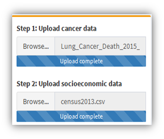

## HealthWebMapper2.0

[HealthWebMapper 2.0](https://haihonghuang.shinyapps.io/appr-upload/) is a web mapping application designed for visualizing cancer disparities in San Diego Sub-Regional Areas(SRAs). 

It was developed and hosted by: [R Shiny](https://shiny.rstudio.com/) and [shinyapps.io](https://www.shinyapps.io/)

HealthWebMapper2.0 URL: https://haihonghuang.shinyapps.io/appr-upload/

Data source: [Live Well San Diego Data Access Portal](https://data.livewellsd.org/)

## How to use (Demo)

1. download preprocessed datasets: click the links [Lung_Cancer_Death_2015_SRA.csv](https://github.com/HDMA-SDSU/HealthWebMapper2/blob/master/demo-datasets/cancer_data/Lung_Cancer_Death_2015_SRA.csv) and [census2013.csv](); view the data in "raw"; Ctrl+S save the files in your loacal computers. 

2. open [HealthWebMapper2.0](https://haihonghuang.shinyapps.io/appr-upload/) and input data    
    
   step 1: upload Lung_Cancer_Death_2015_SRA.csv as cancer data   
   
   step 2: upload census2013.csv as socioeconomic data
   
        
   
   *after uploading, two side-by-side maps will automatically show up within a few seconds, ignore the error message if it fades
           
   step 3: Choose a case or rate
   
   step 4: Choose a socioeconomic factor

3. explore data
   
   
   
   * the side-by-side interacive maps allow you to pan, zoom in/out synchrounously
   
   * switch basemaps and turn on/off overlayers (labels, hospitals and highways)
   
   * click your interested areas to see details about selected data attributes
   
   &nbsp; 
 
     
   
   * choose tool "summary" and click "Add Analysis" to get statistical overview about all the data attributes
   
   * choose tool "correlation" and click "Add Analysis" to get correlation coefficient (Pearson's r). Pearson's r ranges from -1 to 1. The higher the absolute value of Pearson's r is, the stronger the correlation between two variables. However, correlation is not the same as causation.
   
     
   
   * You can change data selection and add more analysis results. For example, compare Pearson's correlation value between Age-Adjusted-Rate/Hispanic_Population and Age-Adjusted-Rate/Median Household Income, which socioeconomic factor is more correlated with lung cancer age adjusted mortality rate?
   
   * switch to Cancer Data Table tab or Socioeconomic Data Table to view uploaded data
 
&nbsp;

> Noted:
>* County age-adjusted rates per 100,000 (2000 US standard population)    
>* Rates per 100,000 population
>* Please interpret with these results with caution - correlation, is not the same as causation. This tool visualizes patterns that can be used for exploratory analysis and hypothesis testing in order to form more complex and realistic models of cancer mortality, but should not alone be interpreted as a valid tool for prediction of cancer outcomes.

## Use your own data

See techincal document [TechDoc_DataPreprocess_HealthWebMapper2.pdf]()
